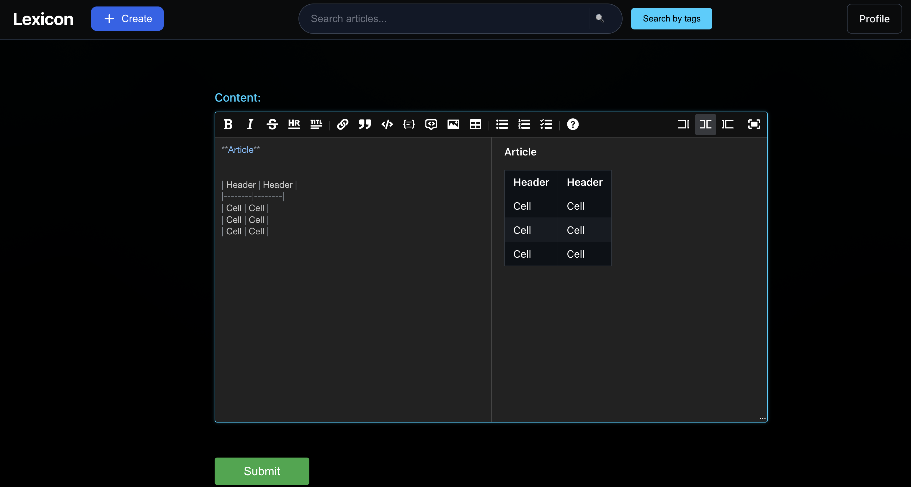
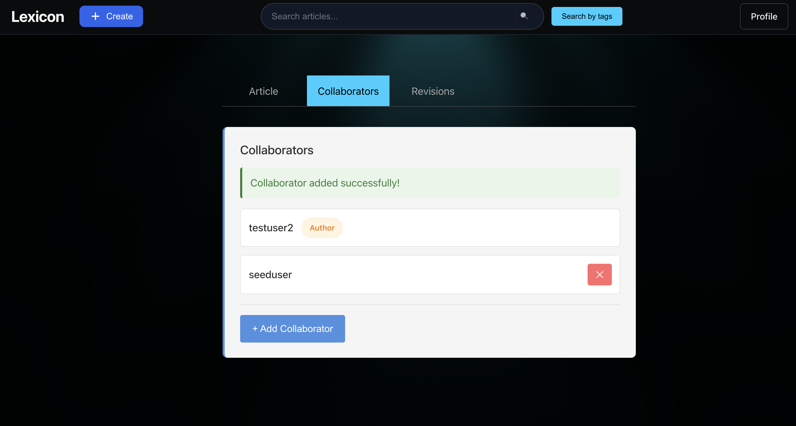
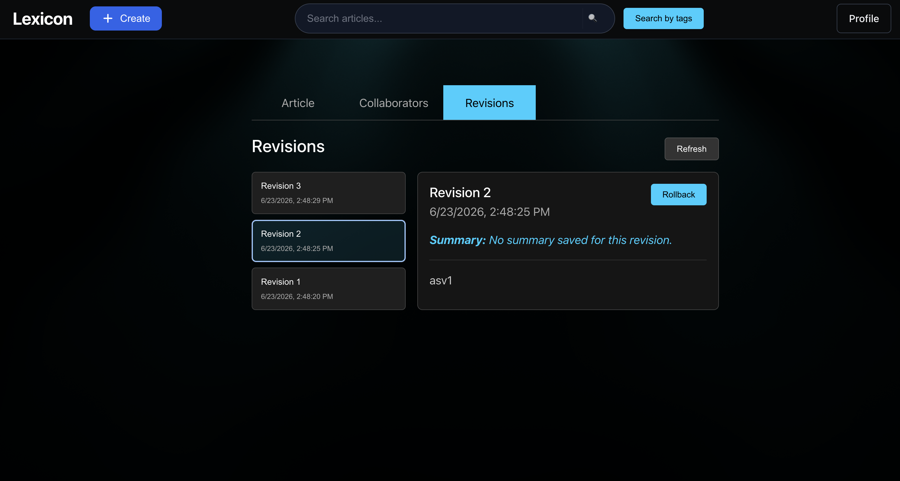

# Lexicon

A collaborative wiki/lexicon app where users create Markdown articles, tag them, invite collaborators, and articles keep a full revision history. Article summaries are auto-fetched from Wikipedia when not provided.

## Screenshots

Write articles in a split-pane Markdown editor with a live preview.



Manage who can edit an article by adding or removing collaborators.



Browse the full revision history of an article and roll back to any previous version.



## Tech Stack

| Layer | Technology |
|---|---|
| Backend | ASP.NET Core (.NET 10) · EF Core · SQL Server |
| Auth | ASP.NET Identity + JWT (access token) + httpOnly refresh-token cookie |
| Frontend | React 19 + Vite |
| Infrastructure | Docker Compose |

## Quickstart (Docker)

```bash
# Copy .env.example → .env and set the two required variables:
#   JWT_SIGNING_KEY=<a long random string>
#   SA_PASSWORD=<SQL Server SA password>
docker compose up
```

- Backend API: http://localhost:5149
- Frontend: http://localhost:5173

## Run Locally (without Docker)

You still need SQL Server running (start it with `docker compose up db`), then:

```bash
# Backend — JWT key via user-secrets
dotnet user-secrets set "Jwt:IssuerSigningKey" "<your-secret>" --project backend
cd backend && dotnet run

# Frontend (separate terminal)
cd frontend && npm install && npm run dev
```

See `CLAUDE.md` for the full local-dev reference including EF Core migrations.

## Tests

```bash
dotnet test LexiconTest/
```

Tests use NUnit + Moq. The test project references the backend directly.

## Project Structure

```
backend/
  Controllers/      HTTP layer — routes, claim extraction, calls services
  Services/         Business logic (articles, Wikipedia integration, auth)
  Data/             Repository interfaces + EF Core implementations
  Model/            Domain entities (Article, Revision, Tag, etc.)
  DTOs/             Request/response shapes
  Migrations/       EF Core migration history

frontend/src/
  api/              HTTP client, auth API, article/tag API
  auth/             In-memory token store
  context/          AuthContext (session restore, refresh wiring)
  pages/            Route-level components
  components/       Shared UI components
```

The backend follows a layered architecture: **Controllers → Services → Repositories → EF Core → SQL Server**.
